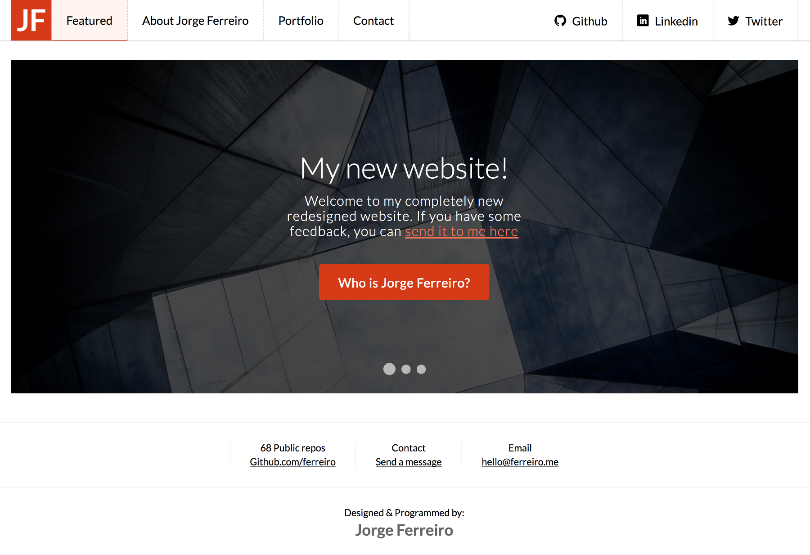
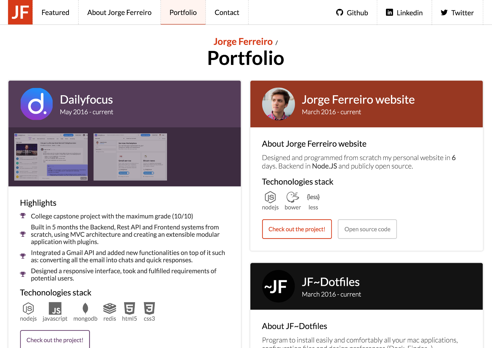
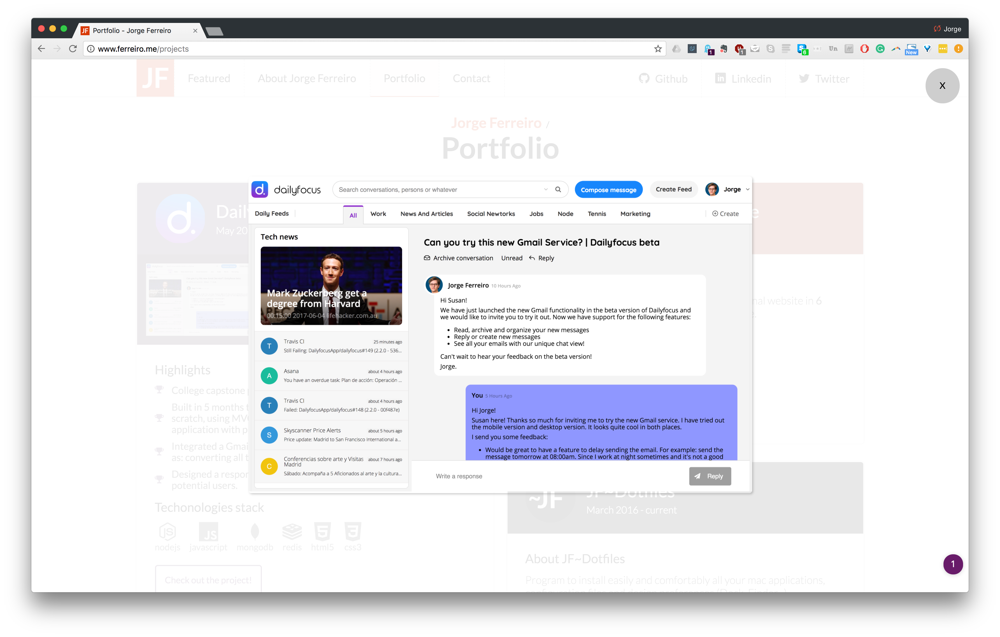

# Jorge Ferreiro website

Disclaimer: This README has some notes, but it's not fully documented yet.

## Env variables

We have all the configuration for beta and prod inside `./env/index.js`, there we load 2 files, the production or the development.

1. You'll need to create a `.env` file to set the required variables:
  ```
  NODE_ENV='DEV'
  SESSION_SECRET='keyboard cat'

  PORT=''
  MONGODB_URI=''
  ADMIN_EMAIL=''
  ADMIN_PASS=''
  MAILCHIMP_API_TOKEN=''

  S3_REGION=''
  S3_BUCKET=''
  AWS_ACCESS_KEY_ID=''
  AWS_SECRET_ACCESS_KEY=''

  CONTACT_EMAIL=''
  MAILGUN_USER=''
  MAILGUN_PASS=''
  RECAPTCHA_PUBLIC=''
  RECAPTCHA_SECRET=''
  NEW_RELIC_LICENSE_KEY=''
  ```
2. Source `.env`
3. Run the server `yarn dev`

## Changelog

### Version 3.5 (December 2018)

* Fully refactor the codebase to use a Ducks pattern. Instead of controllers.js, routes.js, you'll find one folder per functionality. Also, there were some refactors from the web server to the API.

* Revamp completely sections headers and the following sections: home, about and talks.
* Now the blog has a sidebar with useful links, extra information.
* Added new biography.

### Version 3 (fall 2017)

Release date: 17th October 2017

* [v3.0.0 Download](https://github.com/ferreiro/website/releases/tag/v3.0.0)

V3, level up Jorge Ferreiro: The content has arrived.

* Create my personal Blog.
* Added tools to improve development time (Gulp, config files...)
* Improve discoverability: social networks.
* Content oriented: new bio.
* Improved UX by polishing the UI: less is more.
* General refactors to improve Architecture.
* Hello SSL!

### Version 2 (October 2016)

* [v2.0.0 Download](https://github.com/ferreiro/website/releases/tag/v2.0.0)
* [v2.0.1 Fixes](https://github.com/ferreiro/website/tree/v2.0.1)
* [v2.0.2 Fixes (last fixes)](https://github.com/ferreiro/website/tree/dce56266f19644ea1b3560829b1a74f6b5c25a2a)







### Version 1 (Early 2016 - Sep 25, 2016)


## Biography types

I created a system to define my own datatypes so the view can parse and behave differently given the data type.

Attributes:

* icon*: the name of the icon
* body*: text or description of the entry.
* type: my own data types for each entry in the description.
  * entry: a single line.
  * bullets: 1 or more entries.
  * warning: a special type, when you want to highlight something on your entry.
    Warnings have extra attributes:
    
```js
link: {
  url: "http://test.dailyfocus.io",
  target: "blank"
}
```

(*) means this attribute can be nullable. In this case, just set the value to null.

``` js
description: [
  {
    type: "warning",
    icon: null,
    body: "Test out my work! http://test.dailyfocus.io",
    link: {
      url: "http://test.dailyfocus.io",
      target: "blank"
    }
  },
  {
    type: "entry",
    icon: "ion-chatbox-working",
    body: "Bachelor's degree in Computer Science."
  },
  {
    type: "bullets",
    icon: null,
    body: [
      {
        type: "entry",
        icon: "ion-chatbox-working",
        body: "CS 61BL: Data Structures and Programming Methodology."
      },
      {
        type: "entry",
        icon: null,
        body: "COLWRIT 9: Conflict Resolution and Communication Skills."
      }
    ]
  }
]
```